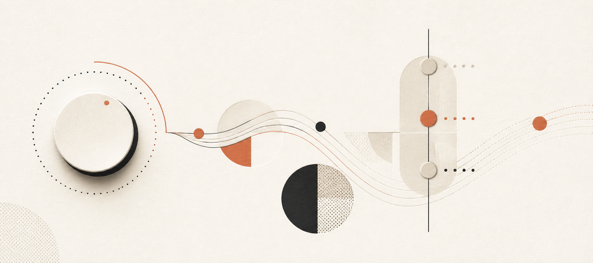

<p align="center">
  
</p>

<h1 align="center">
  
  REAI Demo
</h1>

<p align="center">
  <strong>把 REAI Vibe Board 变成 macOS 的音乐控制台、打砖块手柄和实时语音桌宠。</strong><br>
  <sub>macOS · Objective-C · USB HID · Bluetooth LE · Apple Music · SceneKit</sub>
</p>

<p align="center">
  <a href="#功能">功能</a> ·
  <a href="#交互映射">交互映射</a> ·
  <a href="#快速开始">快速开始</a> ·
  <a href="#实时语音与本地记忆">实时语音</a> ·
  <a href="#开发与验证">开发</a> ·
  <a href="#许可证">许可证</a>
</p>

## 功能

| 能力 | 说明 |
| --- | --- |
| 双通道连接 | USB HID 优先；拔线后自动切换到 BLE GATT，重新插线再切回 USB |
| 音乐控制 | 旋钮调节系统音量，推杆切换 Apple Music 电台与歌单，Action 播放或暂停 |
| 游戏模式 | 原生打砖块界面；旋钮移动挡板，推杆控制球速 |
| 模式选择器 | Tab 打开居中选择器，在音乐、游戏和设置之间切换 |
| 3D 桌宠 | SceneKit 桌宠“川仔”持续漂浮、转身并响应鼠标；桌面显示可独立开关 |
| 实时语音 | 按住语音键对话，实时显示用户转录与 AI 回复字幕；可独立于桌宠显示开关使用 |

后台 App 会自动识别 REAI Vibe Board 的旋钮、推杆和按键事件；当前模式与连接状态显示在
菜单栏，不需要保持主窗口打开。

## 交互映射

### 全局按键

| 控件 | 行为 |
| --- | --- |
| Tab | 打开模式选择器；继续按可循环选择音乐、游戏、设置 |
| Enter / New | 进入当前选中的模式或执行设置项 |
| ESC | 返回上一层；游戏中会暂停并返回模式选择器 |
| AI 语音键 | 按住录音，松开发送；不会自动打开对话记录窗口 |
| Action | 音乐模式播放/暂停；游戏模式发球或暂停/继续 |

### 音乐模式

| 控件 | 行为 |
| --- | --- |
| 旋钮左转 / 右转 | 系统音量降低 / 升高 |
| 旋钮按下 | 静音或取消静音 |
| 推杆高档 · `YOLO` | Apple Music · Find Your Mood · Relax Radio Station |
| 推杆中档 · `CHAT` | Apple Music · Find Your Mood · Focus Radio Station |
| 推杆低档 · `PLAN` | Apple Music Classical · Classical Sleep |

### 游戏模式

| 控件 | 行为 |
| --- | --- |
| 旋钮左转 / 右转 | 挡板向左 / 向右 |
| 旋钮按下 | 发球或暂停/继续 |
| 推杆高 / 中 / 低档 | 快速 / 标准 / 慢速 |

游戏模式下旋钮不会同时改变系统音量，推杆也不会触发 Apple Music。

### 设置模式

设置页支持蓝牙自动连接、重新扫描、忘记设备，以及两个相互独立的开关：

- **桌宠桌面显示**：只控制川仔是否常驻桌面。
- **语音对话**：只控制语音键的录音、转录、AI 回复与语音播放。

因此关闭桌宠后仍可使用语音字幕和回复；关闭语音后桌宠仍可显示并点击查看记录。旋钮选择项目，
Enter、Action 或旋钮按下执行；所有设置通过 `NSUserDefaults` 持久化。

## 快速开始

### 准备环境

- macOS 与 REAI Vibe Board
- Xcode Command Line Tools
- [Homebrew](https://brew.sh/) 与 `hidapi`
- Apple Music；实时语音需要豆包 Speech API Key，本地 AI 回复可选 Ollama `qwen3:1.7b`

```bash
brew install hidapi
git clone https://github.com/lovstudio/reai-demo.git
cd reai-demo
./build.sh
```

构建会生成：

- `REAI Music Controller.app`：菜单栏后台 App 与全部模式 UI
- `reai-volume-controller`：不修改硬件配置的前台诊断工具
- `reai-key-config`：读取和恢复键盘配置的命令行工具

安装到当前用户并启用登录启动：

```bash
./install.sh
```

首次运行时，请允许以下 macOS 权限：

1. 输入监控：读取旋钮、推杆与按键；
2. 蓝牙：使用 BLE 自动重连；
3. 自动化 → Apple Music：控制播放队列和播放状态；
4. 麦克风与语音识别：使用桌宠语音对话。

## 实时语音与本地记忆

在菜单栏 `REAI` 中选择“配置豆包实时语音…”，粘贴 Speech API Key。密钥只写入 macOS
Keychain，不写入仓库、配置文件或日志。实时链路使用 Seeduplex `1.2.6.1` 与 Vivi
`zh_female_vv_jupiter_bigtts` 的 24 kHz PCM 输出；服务异常时回退到本地转录、Ollama
回复与系统备用语音。

按住语音键期间，屏幕底部显示无背景、实心字加描边的实时转录；AI 回答后，同一字幕层切换
为“川仔：…”并逐字更新，保持到最后一段音频实际播放完成后淡出。应用使用独立 Core Audio
输入队列优先选择非蓝牙麦克风，避免录音导致耳机音乐切换到低质量通话模式。

麦克风音频不会保存。用户转录与桌宠回复逐句写入：

```text
~/Library/Application Support/REAI Music Controller/companion-memory.jsonl
```

点击桌宠可居中打开对话记录；记录窗口使用普通窗口层级，不会一直置顶。

## 硬件配置与恢复

读取当前键盘配置：

```bash
./reai-key-config --show
```

设备原始配置备份属于本地资料，不进入 Git。使用自己的 60-byte `.bin` 备份恢复：

```bash
./reai-key-config --restore-native /path/to/your-backup.bin
```

应用还会把当前推杆模式写入：

```text
~/Library/Application Support/REAI Music Controller/current-mode
```

模式变化同时广播 `com.shougongchuan.reai.mode-change`；`userInfo.mode` 为 `YOLO`、
`CHAT` 或 `PLAN`，可供其他 macOS 工作流订阅。

## 开发与验证

### 项目结构

| 文件 | 职责 |
| --- | --- |
| `reai-music-controller.m` | HID 事件分流、Apple Music 控制、菜单栏生命周期 |
| `reai-bluetooth-bridge.m` | BLE 扫描、重连与 GATT 事件桥接 |
| `reai-mode-ui.m` | 模式选择器、设置与原生打砖块 UI |
| `reai-voice-companion.m` | 3D 桌宠、录音、实时语音、字幕和本地记忆 |
| `reai-key-config.c` | 键盘配置读取、备份与恢复 |
| `reai-volume-controller.c` | HID 与 Core Audio 诊断工具 |
| `build.sh` / `install.sh` | 构建、签名、安装与 LaunchAgent 注册 |

### 自测

```bash
./build.sh

./REAI\ Music\ Controller.app/Contents/MacOS/reai-music-controller --protocol-test
./REAI\ Music\ Controller.app/Contents/MacOS/reai-music-controller --ble-protocol-test
./REAI\ Music\ Controller.app/Contents/MacOS/reai-music-controller --tts-parser-test
./REAI\ Music\ Controller.app/Contents/MacOS/reai-music-controller --realtime-transcript-test
```

运行日志位于：

```text
~/Library/Logs/REAI Music Controller.log
```

## 技术栈

- Objective-C / C
- Cocoa、SceneKit、CoreBluetooth、IOKit
- Core Audio、AudioToolbox、AVFoundation、Speech
- Apple Music Automation 与 MediaRemote
- `hidapi`
- macOS Keychain、`NSUserDefaults`、LaunchAgent

项目参考 [ReAI Board SDK](https://github.com/ReAI-com/reai-board-sdk) 的设备连接与协议资料。

## 许可证

源代码采用 [Apache License 2.0](LICENSE) 许可。LovStudio 名称、Logo 与其他品牌资产不因
该许可证而授予商标使用权。
